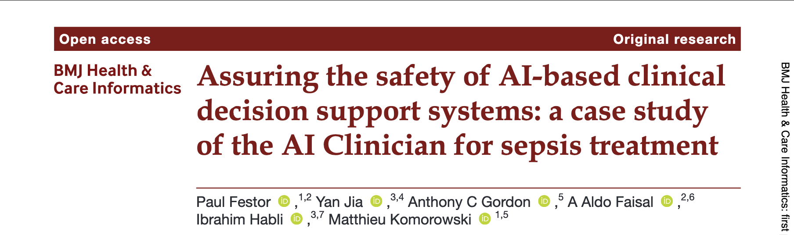
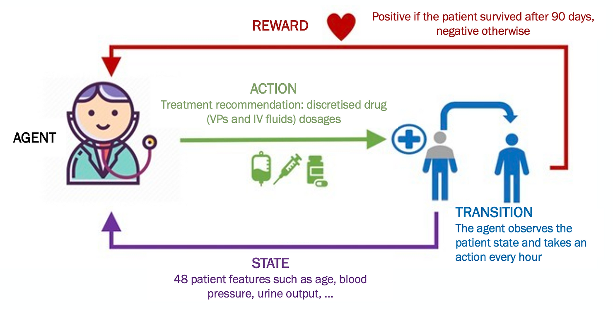
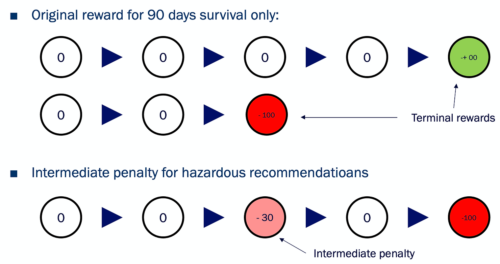

# Making AI safer with Human Knowledge

🎥 Watch a [YouTube video presenting the paper](https://www.youtube.com/watch?v=hqGMOOOh-zU).

_This post gives an overview of_ the _paper "Assuring the safety of AI-based clinical decision support systems: a case study of the AI Clinician for sepsis treatment" published in BMJ Health and Care Informatics in 2022, see the_ [_original paper here_](https://informatics.bmj.com/content/bmjhci/29/1/e100549.full.pdf)_._

AI has shown many promising results in medical applications in the last decade. While imaging-based technologies slowly make their way to the bedside, there remain challenges for AI-powered clinical decision support systems as shown in a [recent review](https://link.springer.com/article/10.1007/s00134-021-06446-7).

One of the barriers in this sector is concerns for patient safety, particularly important in high-stakes contexts. It appears naturally that these are central questions in the context my PhD focuses on; clinical decision support in intensive care.

But how can we actually assess the safety of such systems?

_Credit: Alison Holmes, Imperial College London._

Assessing the overall safety of the entire AI system in all possible scenarios is challenging and safety engineers prefer taking an iterative approach to solving this challenge. Teams identify hazards one after the other, evaluate their consequences, and then list what is in place to prevent them.

This is exactly what we did in this work on a treatment recommendation system for cardiovascular sepsis management. If these terms sound scary to you don't worry, I will lay that down properly below.

## Our application: Reinforcement Learning in Intensive Care

Our team is particularly interested in Intensive Care Units (you have surely heard of those during COVID), specifically in a disease called sepsis (general blood infection with organ failure).

Sepsis is one of the leading causes of hospital deaths and combatting it happens on several fronts. On one side patients are given drugs to clear their body from the infectious agent while, on the other side, support is given to some of their key organ functions if need be. Lungs can be supported with ventilators, dialysis machines can support fatigued kidneys, and various drugs are given to help the cardiovascular system to help it cope with those difficult times.

The latter is particularly interesting [as there still is to this day a large debate in the medical community on what the optimal treatment strategy for cardiovascular management of sepsis is](https://journals.lww.com/ccmjournal/Fulltext/2021/04000/The_Surviving_Sepsis_Campaign__Fluid_Resuscitation.6.aspx).

Leveraging the data collected by hospitals over the past several years, Komorowski et al. published, in 2018, [the AI Clinician](https://www.nature.com/articles/s41591-018-0213-5): a reinforcement learning agent that successfully learnt optimal treatment strategies for those cardiovascular drugs, namely intravenous/IV fluids (salty water injected into the veins to maintain blood volume) and vasopressors (drug compressing the blood vessels).vessels).

The key factor that drives a Reinforcement Learning (RL) agent is how it id being rewarded:

- Want to train an RL agent to master chess? Give it a reward every time it wins a game!
    
- Want to teach an RL agent to drive on a road? Give it a penalty every time it exits the desired path!
    
- Want to teach an RL agent to treat a disease? Give it a reward every time a patient has a positive outcome!
    

This is exactly what [Komorowski et al. did back in 2018](https://www.nature.com/articles/s41591-018-0213-5).

_Quick disclaimer here: I am not a doctor, just an applied mathematician lucky enough to work with medical professionals, so my medical explanations are maybe not the sharpest. For more accurate detail on the condition at hand, you can have a look at the_ [_WHO page on sepsis_](https://www.who.int/news-room/fact-sheets/detail/sepsis) _and dig from there._

## A safer yet still as good AI Clinician

Assessing the safety of a whole system like the AI Clinician (or any clinical decision support tool really), is really challenging and can look daunting. Just like many other ambitious projects, it helps to decompose it into smaller, more accessible, steps.

For example, if you’re looking at the safety of a self-driving vehicle, making sure that it doesn’t crash into the first wall it sees seems like a good start. Not enough to say that the vehicle is 100% safe, but definitely something to be checked one day or another

**Being safe starts by not being obviously unsafe**, which is what we looked for here!

While we don’t know exactly all of the time what the ideal dose of fluids and vasopressors to give to a patient is, we definitely know that giving a lot of fluids to somebody who is already drowning or not giving vasopressors to someone whose blood pressure is extremely low are not healthy choices, to say the least.

Hence, similarly to cars crashing into walls, the clinicians in our team described a set of scenarios and actions that would be obviously dangerous for patients based on underdosing and overdosing fluids or vasopressors to the extrema.

The details of the methods can be found in [our recent publication](https://informatics.bmj.com/content/29/1/e100549) but the principles are rather easy to grasp.

As I said earlier, the key point when training an RL agent is defining when we give it some reward or penalty. This is what drives the AI to do one thing rather than the other.

Therefore, to encourage the agent not to underdose or overdose any of the 2 drugs, we gave it a penalty every time it did!

The agent trained with these new reward signals demonstrated fewer unsafe recommendations than the original AI on retrospective data while maintaining great performance. In other words, adding these safety penalties to the natural reward function led the AI to another optimal, yet safer, treatment strategy.

You may now think: “This looks nice, but what makes your approach stand out?”

Well, the absolute best thing about this reward reshaping approach is that it’s really flexible:

- Want to add one more safety constraint? Just associate a penalty to it and retrain an agent!
    
- Want to give more weight to one constraint or the other? Simply adjust their penalty values!
    

Safety assurance is an iterative process, and so is our approach.

## Wrapping up

In this post, I have given you the general idea behing an idea on how to assess the safety of a treatment recommendation AI. We have seen how human knowledge can be used to make RL-based clinical decision support systems safer and illustrated our general approach on the Ai Clinician for sepsis treatment,

The strategy we introduce here to make offline RL agents safer is rather generic: you just need to define a set of things you want your AI to do less, associate penalties to each of them and retrain it.

Here, we see safety assessment as an iterative process where the system is adjusted step by step to cope with increasingly more hazards.

Want to learn more? Check out the full publication [here](https://informatics.bmj.com/content/29/1/e100549).

If you liked this post, feel free to share it on your social media!

Also, if you know someone interested in this topic, drop them a message!
