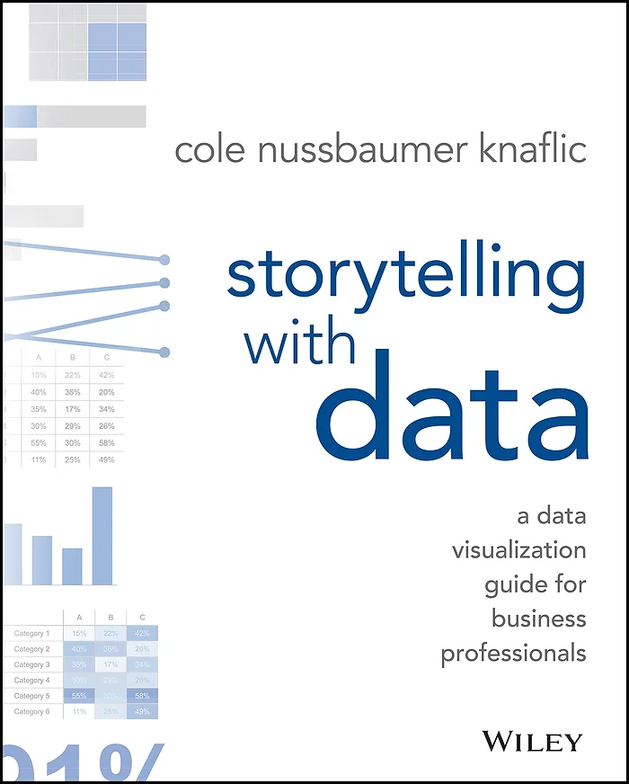
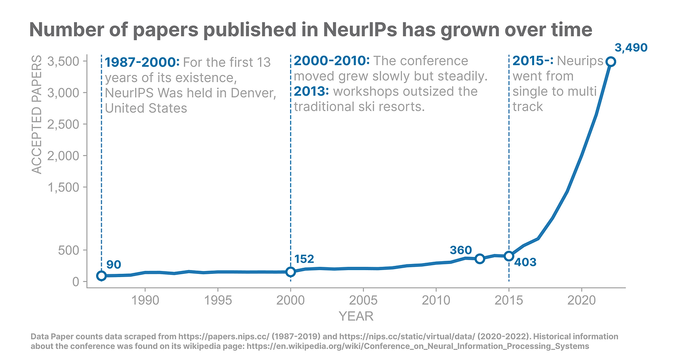

# Storytelling with data: book review and practical example

So I got back into reading and a friend of mine introduced me to the book “storytelling with data” at a time when we were both looking to improve our data visualisation game.

This blog post summarises the main takeaways from this piece, why it should be read by anyone who presents data regularly and my take at making a good visualisation.

## Main lessons

"Storytelling with Data" by Cole Nussbaumer Knaflic is a must-read for anyone looking to up their data visualisation game. In this book, you'll learn the key principles for effectively communicating data-driven insights and discover how to simplify complex information into carefully crafted visualisations.

I was at first not very attracted to the book: the visuals presented there look simple from far away, yet they were all so clear there had to be interesting principles behind their design. Once I started reading, I quickly realised I would not be disappointed by all. This is a fantastic manual that teaches you a step-by-step principled method to designing aesthetic and communicative graphs.

Here's a quick rundown of the 7 key lessons from the book:

1. **Context matters:** just like in copywriting, knowing who you are talking to and what you want them to do is key;
    
2. **Pick the right plot:** you will definitely discover plot types there that you have not heard of before, and scientific reasons why 3D and pie charts are definitely overused;
    
3. **Decluttering:** after Cole shows it to you, you realise that there is a lot of stuff that actually doesn’t bring much to a plot which, once removed, makes the overall visual a lot clearer and more pleasant to the eye
    
4. **How to play with one’s attention:** well-designed plots have mechanisms in place to guide the reader’s attention along a well-thought path, all using subconscious mechanisms. This chapter tells you all about these techniques;
    
5. **Practical design tricks:** making an aesthetic visual is not just a thing for artists, there are very specific points you can look for and fix to make a visual appealing;
    
6. **Stories are powerful:** ever wondered why you remember the plot of your favourite show better than your groceries list? This chapter tells you the power of stories and how they can empower your visuals and presentations
    

By following these lessons, you'll create data visualisations to communicate important insights through captivating stories. "Storytelling with Data" is packed with detailed examples and case studies, making it a must-have resource for anyone looking to level up their data storytelling skills.

## Putting it all into practice

I am a firm believer in “learning by doing”: reading a book an about how to design communicative data visualisations is one thing, but making my own designs is another!

To put “Storytelling with data” into practice, I set myself on a journey to create an effective visual.

One topic that I find both fascinating and daunting as an artificial intelligence researcher is the pace at which this field grows. More and more papers come out every year making it challenging to keep up with all the latest progress on the state of the art.

While I had this feeling, I did not have any concreter data visualisation that backed my point, making for a perfect opportunity to tell a story with data.

As a proxy for the growth of the field, I scraped the number of papers published every year at NeurIPS, a leading conference in the field of AI. To bring depth to the final story, I also made a bit of research on the genesis and story of the conference.

This data, combined with the lessons in Cole’s book, led to the following visual:

This plot is definitely different to the one I would have produced had I not known about the tricks in “Storytelling with data”: the attention to alignment to the choices of colours and thichkesses to direct the reader’s eyes, the added context, and more.

## Conclusion

In a nutshell, “Storytelling with data” by Cole Nussbaumer Knaflic is an amazing cookbook for data visualisation. It gives the reader a streamlined process for visualisation design, turning what can look like a very unstructured task into a principled step-by-step method.

I highly recommend this book to any data professional: if you work with data then learning how to best present it will be an extremely valuable life skill!

If you want to see more on the topic, Cole feeds a great blog eponymous with the book [here](https://www.storytellingwithdata.com/) or check out [this Reddit thread](https://www.reddit.com/r/dataisbeautiful/) for inspirational visualisations.

