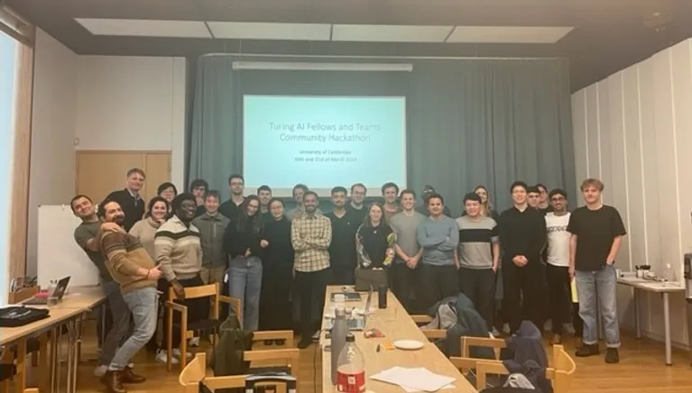
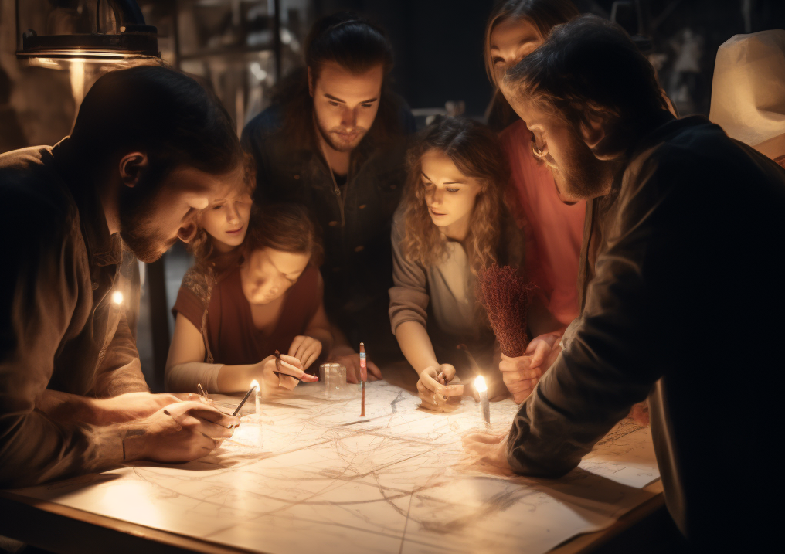
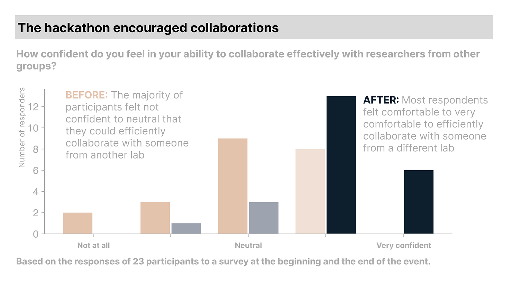

# Organising a national collaborative ML research hackathon

Hey there! This post tells how we organised a collaborative hackathon to tighten a UK AI community and facilitate collaborations.

*Hackathon participants*

## Context: noticing the opportunity and initial idea

In December 2022, several people from my lab went to Cambridge to attend a mini-conference for Alan Turing fellows to share their research. Our PI being one of them, he invited a few of us to come along to get to know the UK research in AI better.

We had a great time there meeting like-minded scientists who were pushing AI state-of-the-art in many different directions. From theoretical work to more applied, from NLP to reinforcement learning, the variety of the work presented there was great. Given that we are a pretty diverse lab, it was a good occasion for all of us to talk with new faces about common problems.

As the day went on, we realised that the research landscape on AI in this community was really dense and, while the Turing AI fellows (often postdocs or senior academics) knew about each other’s research, PhDs did not know as much about the work conducted elsewhere. This was quite a shame given how geographically close we were from one another (the UK is not this big). Because of that, we were certainly missing out on great collaboration opportunities that could lead to top research outcomes.

At the lunch break, having made this observation, a few of us decided that tightening the community would be great, and we started thinking about a hackathon to do so. 

With the support of Neil Lawrence and the Alan Turing Institute, this idea came to life and a few weeks later we had our first preparation meeting.

## Preparing the event: When? How? What?

The objective of organising an event was clear: getting the Turing fellows’ teams to know one another. But how?

We needed something that would get people to spend time together, combine their expertise to crack a problem and, hopefully, build connections and friendships.

We rapidly came to the idea of a hackathon but were very unsure about the competition side of things. In fact, we wanted to build a sense of community where it is ok to talk between teams and have across-the-board collaborations.

Another challenge was the variety of expertise in the community. While this is a great asset for research, it makes it challenging to design a scientific event that pleases everyone. If some are experts in image analysis, others in statistical methods and some are into reinforcement learning, how on Earth can you find a challenge that makes everyone feel at ease?

After a bit more thinking, we settled on a format that ticks all the boxes.

First, after polling potential participants on their research interests, we would offer 3 different challenges each linking to separate AI specialties.

- Hyperresolution of weather forecasts
    
- Causal inference on cancer genes
    
- Learning to control a power grid with reinforcement learning
    

Second, the event was presented as a collaborative hackathon, not a competition. We encouraged a minimum number of people per team but did not really put a maximum.

One of the ideas that made the success of the event was to set whiteboards around the room with the problem names on them for participants to gather around and exchange initial ideas. This setup allowed like-minded people to meet each other and gather around similar general ideas to tackle each problem.

In the end, each team presents their results in a short pitch and everyone goes away with perks from the Alan Turing Institute. Thank to the support of Neil Lawrence and the Institute, both accommodation and food was taken care of, and thanks to Cambridge members in the committee, evening plans were sorted. The hackathon would take place over 2 days with socials in the evening to strengthen newly created bonds.

## high-quality

Overall, the event went really well! Based on a poll we ran before and after the event, we matched our goal of building a group and facilitating collaborations!

I was really impressed by the groups’ presentations after just a few hours of working together. See [the event’s website](https://uk-ai.org/e-hackathon-march-2023/) for the presentations.

Being part of the organisational committee for this event was very instructive for me, here are my main takeaways:

- Take initiatives: it took a bit of initiative to turn a discussion around a coffee into an actual event, but it was well worth it
    
- Don’t hesitate to ask for advice: white took part in organising large events in the past ranging from a few attendees to thousands, it’s been a while and asking for a refresher to someone who does this regularly helped us get the details right
    
- Work on everybody’s strengths: as in every team, each member of the organisational committee had their strengths. Allocating the right job to everyone ensured motivation and high-quality results
    
- Find a way to measure success: when someone asks you afterwards "How did the event go?" and you want to show them you did well, it's better to have data that backs your point! That's the role of the bar plot on collaboration above.
    

Organising and participating in this hackathon has been a very insightful and motivating experience for me. The community met again for an internal conference in May, and the heightened closeness among members was palpable.

More events should come in this community. Follow the official website to stay up to date!
